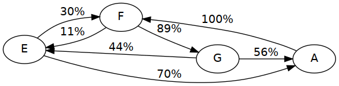
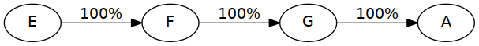
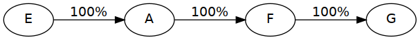

# likely music

## Synopsis

experimental application for probabilistic music composition

## Description

likely music is a project I built in 11th/12th grade during my so called “P-Seminar” (a career orienting course at German (high) schools). For my particular one we were tasked to create an entry for the crossmedia competition (“crossmedia Wettbewerb”), a Bavarian multimedia competition targeted at students. Entries may range from original music videos to games — or in my case software.

The initial idea for likely music was to generate random music along some kind of guideline in order to prevent it from sounding absolutely horrible. Such a guideline would then become a kind of notation in its own right (a meta-notation if you will). Leaving things up to the (usually) person playing a piece of music is not at all unheard of in music — which is why you also call a musical performance an interpretation. By leaving it up to interpretation which note comes next this (within preset boundaries) this concept is taken to the extreme.

The concept for likely music's notation is the following: We use a directed graph to represent *possible* successions of notes that could make up the piece of music when it's played. Each node contains classical notation (in likely music it is limited to single notes to simplify frontend implementation). Each edge represents a possible succession of two nodes and has a probability associated with it. Such a graph-based notation could look like the following.



When interpreting such a graph you then pick a starting note, play its note(s) and then pick an edge from the node factoring in its probability to get a new node and repeat this cycle. Since such graphs can be cyclical you can get infinite, randomly varied music this way. If you limit the length of such an interpretation to 4 and start at the E you could get one of the below actual successions from the above graph — or different ones of course.





Computers are (maybe counter-intuitively) better at picking things at random quickly, especially in this case. Since by using a pseudo random number generator, we can easily recreate previous interpretations we liked by saving the used seed.

The scope of likely music I decided on for the project was: A graphical application to edit graph based notation of probabilistic music which has the ability to generate interpretations of it using a midi instrument or similar.

Initially I considered building a GTK application, but quickly abandoned this idea although it would have meant a better, more convenient to use result. I had no prior experience with GTK and would have needed to make sure it was portable to Windows. Additionally it didn't seem simple to implement a graph editor in GTK (maybe I was wrong and there's an amazing library for it). I then settled on a web app with a backend handling the heavy lifting of generating interpretations. Writing a backend allowed me to use Haskell and reuse some code I initially wrote towards a GUI application and saved me from messing around with graph processing and midi in JavaScript.

The frontend is implemented in EcmaScript 6 and uses [vis.js](https://visjs.org/) for its graph editor which is the center piece of the application. You can edit and create graphs and their probabilities and musical notes, load and save your notations from/to your computer and request interpretations from the backend. You can directly listen to them in the browser or download them as WAV or MIDI file. The result can be modified by supplying a seed and a maximum length (in notes) of the interpretation. 


The backend is implemented in Haskell and uses servant to serve a very simple JSON-based API to the client:

* `/interpretation/<format>`: Given a graph, maximum length and seed, return an interpretation in `<format>` (MIDI or WAV)
* `/seed`: return a random seed for use with `/interpretation`

Representation of graphs and generating interpretations of them is implemented in a separate library providing the module `Sound.Likely`. It is pretty simple, since the task at hand actually requires no crazy data structure or algorithms: The [directed Graph](lib/Sound/Likely.hs#L59) is implemented roughly as `Map Node (Set Edge)`. [Producing an interpretation](lib/Sound/Likely.hs#L69-L77) is as simple as: lookup a node, pick an edge, repeat. For music/note representation and MIDI functionality it uses [Euterpea](https://hackage.haskell.org/package/Euterpea).

A more detailed documentation of the inner workings and the concept of likely music can also be found in the [German documentation](doc/einreichung/einreichung.pdf) I compiled for the entry of the competition. I think the code is fairly readable as well, especially `Sound.Likely` which isn't that big anyways and probably the most interesting piece of this software. 

The project was completed in about a month during my summer holidays of 2017 with a prior experiment called `probable-music` which I rewrote into likely music. Of course completed is relative — I had plenty more ideas for improvement, but this being a competition entry and a experimental implementation of an obscure concept you have to draw the line somewhere. Unfortunately my entry to crossmedia was never judged. I was informed that the jury didn't really understand my entry or how to use it. This of course was disappointing since I thought I had a good shot at a price back then and I was unsure where I went wrong or if at all. I tried to document the application very thoroughly both in functionality and concept and even submitted a screencast of me using it. My best guess is that the UX wasn't intuitive enough for the judges which were mostly high school teachers (as far as I know). It was especially disappointing since I was later able to show my project to one of the judges in person and they were rather impressed by it. Overall it was a good experience nonetheless even though it ultimately didn't really amount to anything. Building a not perfect, but functional application with an interesting concept in about a month is something I'm pretty happy with.

## Setup

If you want to try it out for yourself, you'll have to build it locally, since I don't host the application anymore.

### Using nix

[nix](https://nixos.org/nix/manual/#chap-introduction) is a cool package manager you can install alongside your existing package manager or even on macOS or you'll have it installed if you use NixOS.

* To install, run `nix-env -f https://github.com/sternenseemann/likely-music/archive/master.tar.gz -iA likely-music`
* To build from the git repository run `nix-build -A likely-music` in a local checkout

Then you should be able to run `likely-music` from the command line (in the latter case it's in `./result/bin`) and open `http://localhost:8081` in your browser to use likely music.

### Manual

First make sure you have the following prerequisites installed:

* Functional Haskell environment, i. e. `ghc` and `cabal-install`
* `yarn`
* A MIDI to WAV synthesizer
    * One possibility is fluidsynth:
        * `fluidsynth`
        * `soundfont-fluid` (in `/usr/share/soundfonts/FluidR3_GM.sf2`)
    * Any other executable that accepts two arguments: a midi file and a target wav file path (see the explanation of `LIKELY_MUSIC_SYNTH` below for details).

Then run the following commands:

```bash
cd /path/to/likely-music

cd web
yarn install --pure-lockfile
yarn run build:assets
yarn run build:prod

# optionally if you want to avoid relative path problems
export LIKELY_MUSIC_FRONTEND=/path/to/web/dist

cd ..
cabal v2-build
cabal v2-run likely-music-backend
```

Then you can navigate to `http://localhost:8081/` and it should be ready to use.

You can modify were likely music looks for dependencies using environment variables:

* `LIKELY_MUSIC_FRONTEND` should point to the `dist` folder of the built frontend (if missing `./web/dist` is assumed)
* `LIKELY_MUSIC_SYNTH` should point to an executable (only a single file, no arguments) which accepts two command line arguments, `<infile>.mid` and `<outfile.wav>`, when it's called it should render the MIDI file as a `<outfile>.wav` and exit. It is probably best to use a wrapper script here like [`fluidsynth-wrapper`](pkgs.nix#L21). If this environment variable is missing, likely music will assume `fluidsynth` is in `PATH` and `soundfont-fluid` at the location mentioned above.

### Common Problems

* The build frequently breaks because of `Euterpea` which is unfortunately not maintained very well and as a result often fails compiling due to updates of its dependencies. If it happens again, feel free to [open an issue with Euterpea](https://github.com/Euterpea/Euterpea2/issues/) or send me an email!

## Changelog

* 0.1.1:
    * Pass dependencies to `likely-music-backend` using `LIKELY_MUSIC_FRONTEND` and `LIKELY_MUSIC_SYNTH`
    * Nix-based build system
    * Dependency updates and related build fixes
* 0.1.0 (2017-09-28): competition entry
    * [Detailed description](doc/einreichung/einreichung.pdf) in German
    * Git revision: `72fabd589707f9e9c9d06e74bded585fb20468d4`

## TODO

- [x] overlay styling
- [x] quicksave in localstorage
- [ ] **[MIDI parameters](https://hackage.haskell.org/package/Euterpea-2.0.3/docs/Euterpea-Music.html#t:Control) (instrument, speed)**
- [x] WAV export (using fluidsynth)
- [x] in browser player
- [x] nice unicode musical symbols
    - [x] **handle pointed notes**
- [ ] **graph validation**
- [ ] **add help text**
- [ ] custom manipulation bar style
- [x] Seed storage / reproducible playback
- [ ] JS refactoring
- [ ] support for non-primitive `Music` in frontend

### Things for later

- [ ] Other instruments
- [ ] support FLAC, OPUS export etc.
- [ ] multiple starting points, parallel graph traversal
- [ ] read in fully composed music (midi, lilypond) and generate a base graph (thanks [kohlrabi](https://github.com/kohlrabi23))

## License

AGPL, might dual-license if provided a good reason.
