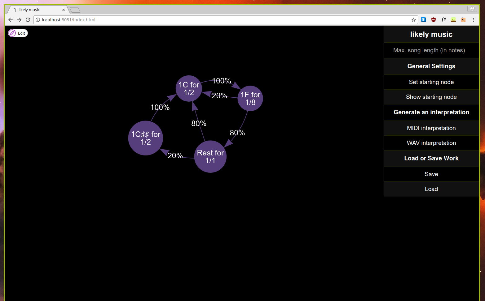

# likely music



## TODO

- [x] overlay styling
- [x] quicksave in localstorage
- [ ] MIDI parameters (instrument, speed)
- [x] WAV export (using fluidsynth)
- [ ] in browser player (by exporting a mp3 or similar using fluidsynth and
  loading using javascript)
- [x] nice unicode musical symbols
  - [ ] handle pointed notes
- [ ] graph validation
- [ ] add help text
- [ ] custom manipulation bar style
- [ ] Seed storage / reproducible playback
- [ ] JS refactoring
- [ ] switch to SASS or similar
- [ ] multiple starting points, parallel graph traversal
- [ ] support for non-primitive `Music` in frontend

## Setup

```
cabal sandbox init
cabal install --only-dependencies
cabal build

cd web
yarn install
yarn run build:dev

cd ..
cabal run likely-music-backend
```
