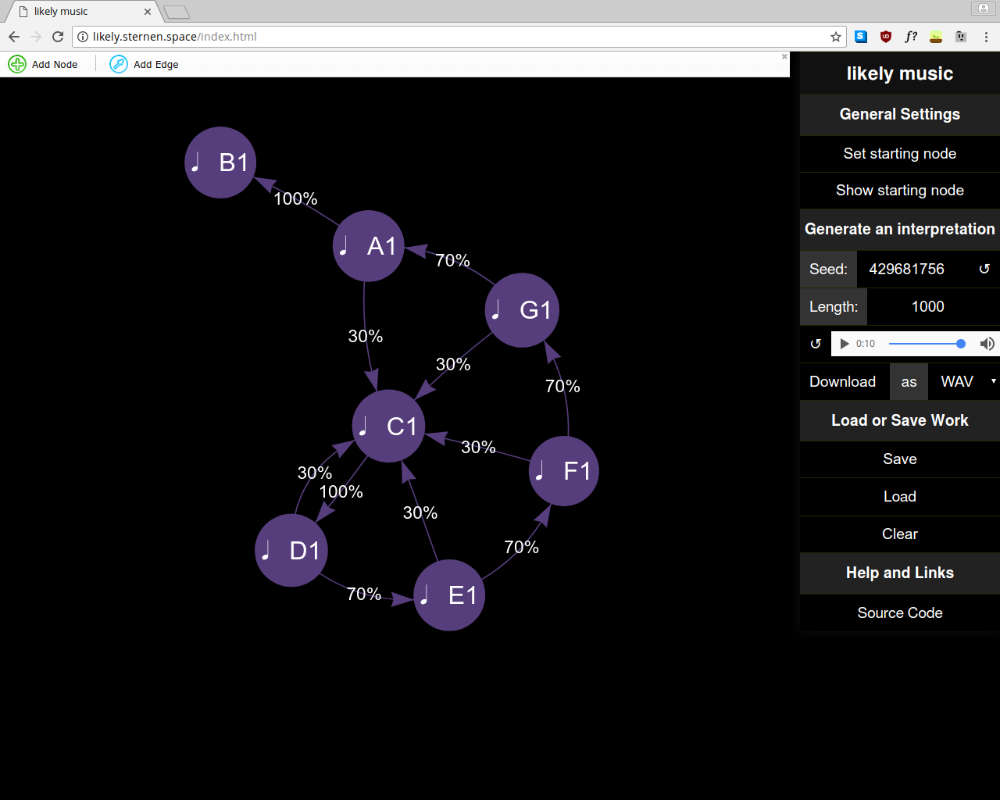

# likely music



## TODO

- [x] overlay styling
- [x] quicksave in localstorage
- [ ] **[MIDI parameters](https://hackage.haskell.org/package/Euterpea-2.0.3/docs/Euterpea-Music.html#t:Control) (instrument, speed)**
- [x] WAV export (using fluidsynth)
- [x] in browser player
- [x] nice unicode musical symbols
  - [ ] **handle pointed notes**
- [ ] **graph validation**
- [ ] **add help text**
- [ ] custom manipulation bar style
- [x] Seed storage / reproducible playback
- [ ] JS refactoring
- [ ] use postcss etc.
- [ ] support for non-primitive `Music` in frontend

### Things for later

- [ ] support FLAC, OPUS export etc.
- [ ] multiple starting points, parallel graph traversal
- [ ] read in fully composed music (midi, lilypond) and generate a graph (thanks [@kohlrabi23](https://github.com/kohlrabi23))

## Setup

```
cabal sandbox init
cabal install --only-dependencies
cabal build

cd web
yarn install
yarn run build:dev

cd ..
cabal run likely-music-backend
```

## I want the library non AGPL-licensed

Please approach me.
